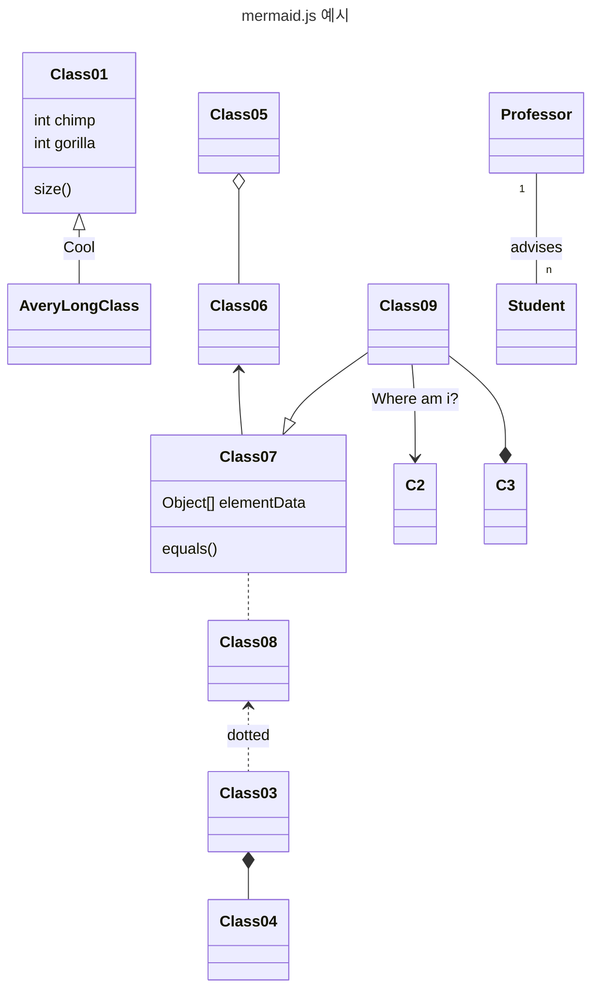

```mermaid
---
title: mermaid.js 예시
---
classDiagram
%% 상속 관계 [슈퍼 클래스: Class01, 서브 클래스: AveryLongClass]
    Class01 <|-- AveryLongClass: Cool
%% 합성 관계 Class03, Class04 (생성 및 소멸을 함께 함)
    Class03 *-- Class04
%% Class05는 Class06과 생명 주기가 다른 연관 관계
    Class05 o-- Class06
%% Class07는 Class08과 연관 관계
    Class07 .. Class08
%% Class09는 C2와 단방향 연결
    Class09 --> C2: Where am i?
%% Class09는 C3와 강한 연결
    Class09 --* C3
    Professor "1" -- "n" Student : advises
    Class09 --|> Class07
    Class07: equals()
    Class07: Object[] elementData
    Class01: size()
    Class01: int chimp
    Class01: int gorilla
    %% Class03이 Class08을 의존하고 있음
    Class08 <.. Class03: dotted
    Class06 <-- Class07
```